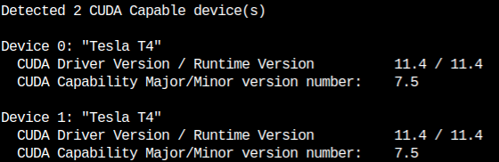
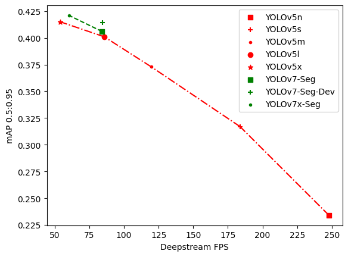

# Deepstream real-time instance segmentation

Real-time instance segmentation

Youtube link:

## Support model

- YOLOv5-Seg
- YOLOv7-Seg

## Prerequisites

- Deepstream 6.0.1
- TensorRT-OSS: [github.com/hiennguyen9874/TensorRT](https://github.com/hiennguyen9874/TensorRT)

## Getting started

### Convert model to engine file

- Download model from [github.com/hiennguyen9874/deepstream-yolov7-mask/releases/tag/v0.1](https://github.com/hiennguyen9874/deepstream-yolov7-mask/releases/tag/v0.1) or export onnx file from weight:

  - [github.com/hiennguyen9874/yolov5-seg](https://github.com/hiennguyen9874/yolov5-seg)
  - [github.com/hiennguyen9874/yolov7-seg](https://github.com/hiennguyen9874/yolov7-seg)

- Export onnx to tensorRT: `/usr/src/tensorrt/bin/trtexec --onnx=./models/yolov7-seg-dev.onnx --saveEngine=./models/yolov7-seg-dev.trt --fp16 --workspace=8192`

### Build custom parser

- `cd nvdsinfer_customparser`
- `make`

### Run

- `bash ./run.sh`

## Docker

### Get cuda version number

- `docker run -v ${PWD}:/app/ -w /app --rm --gpus all -it nvcr.io/nvidia/deepstream:6.0.1-devel bash -c 'nvcc deviceQuery.cpp -o deviceQuery && ./deviceQuery'`

- Modify DGPU_ARCHS in docker compose

- Example (DGPU_ARCHS=75):
  

      
  

### Run

- build: `docker-compose build`

- up: `docker-compose up`

- Output video in `outputs` folder

## Benchmark

Test on T4

    

| Model          | FPS    | mAPval 0.5:0.95 (Box) | mAPval 0.5:0.95 (Mask) |
| -------------- | ------ | ----------------------------- | ------------------------------ |
| YOLOv5n        | 247.97 | 0.27                          | 0.234                          |
| YOLOv5s        | 183.77 | 0.372                         | 0.317                          |
| YOLOv5m        | 119.58 | 0.445                         | 0.373                          |
| YOLOv5l        | 85.80  | 0.484                         | 0.401                          |
| YOLOv5x        | 54.04  | 0.502                         | 0.415                          |
| YOLOv7-Seg     | 84.12  | 0.49                          | 0.406                          |
| YOLOv7-Seg-Dev | 84.59  | 0.505                         | 0.414                          |
| YOLOv7x-Seg    | 60.29  | 0.511                         | 0.421                          |